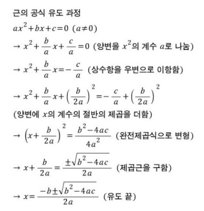
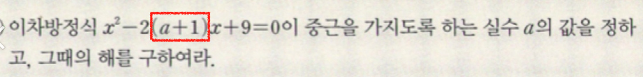
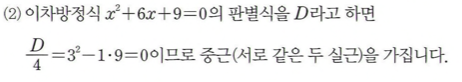

## 개요

**방정식**

미지수의 값에 따라 참일 수도 있고 거짓일 수도 있는 등식을 방정식이라고 한다. 이때 방정식을 참이 되게(True) 하는 미지수 값을 해 또는 근이라 하고, 해 또는 근을 구하는것을 방정식을 푼다라고 이야기한다.

**방정식이 ax=b 일때**

$$
ax=b
$$

위 방정식은 일차 방정식이다. 두 가지 방법으로 해를 구해볼 수 있는데 조건이 존재한다.

1. a ≠ 0, 0이 아니라면 방정식 양변을 a로 나누면 x = a/b
2. a == 0, 뭘 곱해도 0*x인 상황이라 상수항 b에 따라 결과가 달라지는데 b가 0이 아니라면? 등식이 성립하지 않게되서 해가 없다 혹은 불능이라고 표현을 한다.  반대로 b도 0이라 x에 어떤 수를 대입해도 항상 등식이 성립하게 되는데 이때는 방정식의 해가 무수히 많다. 이차방정식의 부정 이라고 말한다.

## **정의**

$$
ax^2+b^x+c=0 (a!=0)
$$

이렇게 나타낼 수 있는 방정식을 x에 대한 이차방정식이라고 한다. 중학교 과정에서는 이차방정식의 근을 실수 범위에 대해서만 구하기 때문에 찾을 수 없지만 고등학교 과정에서는 복소수 범위까지 확장하기 때문에 허수를 이용한 근도 등장한다.

## 풀이

좌변이 인수분해 가능하냐 아니냐로 나누어진다. 인수분해가 되지 않을때는 완전 제곱식을 사용하여 해를 구해야하는데 이를 공식화 시킨것이 근의 공식이다. b의 계수가 짝수인경우는 변형된 인수분해 공식을 사용한ㄷ. 

**성질**

1. AB = 0 이면 A = 0 or B = 0
2. A^2 = B면 A = sqrt(B) or -sqrt(B)

근의 공식에서 루트 부분에 있는 b^2-4ac가 0보다 크다면 실수의 범위, 작다면 허수의 범위에 속한다. 실수인 근을 실근, 허수인 근을 허근이라고 표현하고 두 실근이 같다면 중근이라고 표현한다.

## 작은 실수
### b의 계수가 짝수인 이차방정식
- b 프라임  
이차방정식 b의 계수가 짝수일때 근을 판별하는식은 4/D = b'^2 - ac 이다.

저기 박스친곳이 b의 프라임이라 (a+1)^2을 전개해야한다. 이전까지 -2까지 같이 전개했다.
앞에 부호까지 신경쓰지않고 괄호안 b'만 제곱한다.

- b 계수  
6^2인 36을 계산하는게 아니라 2b'^2 이 내포되어있어서 3을 제곱한다.
 